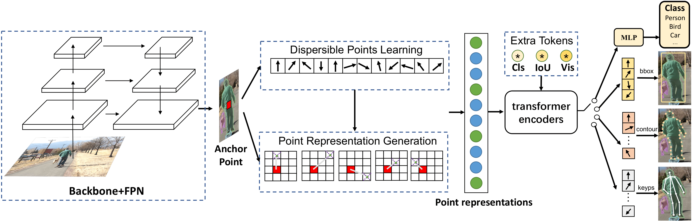

# UniHead
Official code for "Unifying Visual Perception by Dispersible Points Learning". The implementation is based on [United-Percepion](https://github.com/ModelTC/United-Perception).

## Introduction
UniHead is a plug-in perception head which can be used in different detection frameworks (two-stage or one-stage pipelines), and different tasks (image classification, object detection, instance segmentation and pose estimation).

## Guide to Our Code
Currently, configs can be found in [configs/unihead](configs/unihead).

## Experiments on MS-COCO 2017
_Our original implementation is based on the unreleased internal detection framework so there may be a small performance gap._

### Different Detection Pipelines
| Pipeline  | mAP  | Config                                                       | Model                                                        |
| --------- | ---- | ------------------------------------------------------------ | ------------------------------------------------------------ |
| two-stage | 42.0 | [config](configs/unihead/two-stage-det-unihead-resnet50-coco-1x.yaml) | [google](https://drive.google.com/file/d/1TwFCog_PMd1HWA7s-s9pN2F_fgyMyR3x/view?usp=sharing) |
| cascade   | 42.8 | [config](configs/unihead/cascade-det-unihead-resnet50-coco-1x.yaml) | [google](https://drive.google.com/file/d/1kGdr9o5xIKwnYPZA0WGFLlsYAbbNsEDn/view?usp=sharing) |

### Different Tasks
| Task                  | mAP  | Config                                                       | Model                                                        |
| --------------------- | ---- | ------------------------------------------------------------ | ------------------------------------------------------------ |
| detection             | 42.0 | [config](configs/unihead/two-stage-det-unihead-resnet50-coco-1x.yaml) | [google](https://drive.google.com/file/d/1TwFCog_PMd1HWA7s-s9pN2F_fgyMyR3x/view?usp=sharing) |
| instance segmentation | 30.3 | [config](configs/unihead/ins-seg-unihead-resnet50-coco-1x.yaml) | [google](https://drive.google.com/file/d/1BrBSPTFZ4ulgJSACoux0CMrBjPWoJGDi/view?usp=sharing) |
| pose estimation       | 57.6 | [config](configs/unihead/keyp-unihead-resnet50-coco-mstrain-2x.yaml) | [google](https://drive.google.com/file/d/19rr9yMRvhq6eBLDNgMzW4b9CR-iEj32D/view?usp=sharing) |

More results and models will soon be released.

## LICENSE 

This project is released under the MIT license. Please see the [LICENSE](LICENSE) file for more information.
